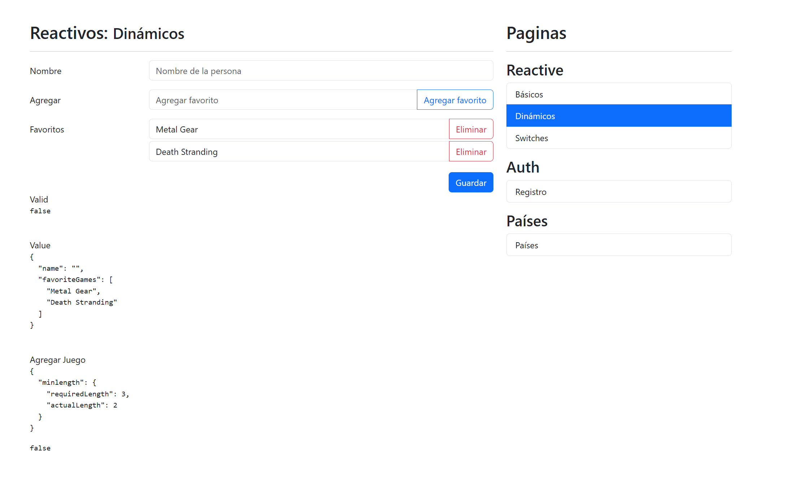

Español | [English](README.md)

# ReactiveFormsApp

[](https://angular.dev/)
[](https://www.typescriptlang.org/)
[](https://getbootstrap.com/)



<br>

Este es un **proyecto de aprendizaje y práctica** construido con Angular para explorar y comprender cómo funcionan los **formularios reactivos**.
La aplicación demuestra diferentes tipos de controles de formulario, como **inputs de texto y número, switches, radio buttons y selectores poblados con datos de la API REST Countries**, incluyendo renderizado dinámico de datos y gestión del estado del formulario.

El objetivo de este proyecto es practicar conceptos de Angular tales como:

- **FormArrays Dinámicos:** Implementación de campos que se pueden añadir o eliminar en tiempo real (comportamiento tipo CRUD).
- **Validaciones Avanzadas:** Validadores personalizados síncronos y asíncronos, incluyendo gestión compleja de mensajes de error.
- **Integración de API REST:** Carga de selectores con datos dinámicos provenientes de la **REST Countries API**.
- **Flujos de Datos RxJS:** Gestión de estados reactivos y efectos secundarios dentro del ciclo de vida del formulario.
- **Estado de UI/UX:** Feedback visual basado en los estados del input (`valid`, `invalid`, `touched`, `dirty`).

<br>

## Tecnologías

- Angular 21
- TypeScript
- Bootstrap 5.3

<br>

## Instalación

1. Clonar el repositorio:

   ```bash
   git clone https://github.com/Antonio-Borrero/reactive-forms-app-angular.git
   ```

2. Instalar las dependencias:
   ```bash
   npm install
   ```
3. Ejecutar la aplicación en modo desarrollo:

   ```bash
   ng serve
   ```

4. Abrir en el navegador:
   - Ir a http://localhost:4200/.
   - La aplicación se recargará automáticamente cuando se modifique algún archivo

<br>

## Funcionalidades

- Múltiples ejemplos de formularios reactivos con diferentes tipos de inputs
- Inputs básicos (texto, número, etc.)
- Controles avanzados (switches, radio buttons, checkboxes)
- Renderizado dinámico de la información introducida por el usuario en tiempo real
- Validación de formularios y gestión del estado de los inputs
- Selectores poblados con datos de una API externa
- Gestión de datos reactiva usando RxJS

<br>

## Aprendizajes

- Cómo funcionan los formularios reactivos en Angular
- Creación y gestión de controles y grupos de formulario
- Manejo de validaciones y estados de inputs
- Trabajo con diferentes tipos de inputs
- Gestión de datos dinámicos dentro de los formularios
- Integración de datos externos en los formularios (consumo de APIs)
- Uso de RxJS para manejar flujos de datos reactivos

<br>

## Estructura del proyecto

```bash
- src/
 └───app
    ├───auth
    │   └───pages
    │       └───register-page       # Página con un formulario reactivo para registro de usuarios (validaciones, inputs, manejo de formulario)
    │
    ├───country
    │   ├───interfaces              # Interfaces de TypeScript para tipar los datos de países (respuestas de la API)
    │   ├───pages
    │   │   └───country-page        # Página que muestra selectores poblados con datos de la API
    │   └───services                # Servicios para consumir la API de países
    │
    ├───reactive
    │   └───pages
    │       ├───basic-page          # Ejemplos básicos de formularios reactivos (inputs de texto, número, validaciones)
    │       ├───dynamic-page        # Formularios dinámicos con agregar/quitar campos (comportamiento tipo CRUD)
    │       └───switches-page       # Controles avanzados (switches, checkboxes, radio buttons)
    │
    ├───shared
    │   └───components
    │       └───side-menu           # Componente reutilizable de navegación
    │
    └───utils                       # Funciones auxiliares para validaciones personalizadas y manejo de mensajes de error
```

<br>

## Produccion

Para compilar la versión de producción:

```bash
ng build
```
